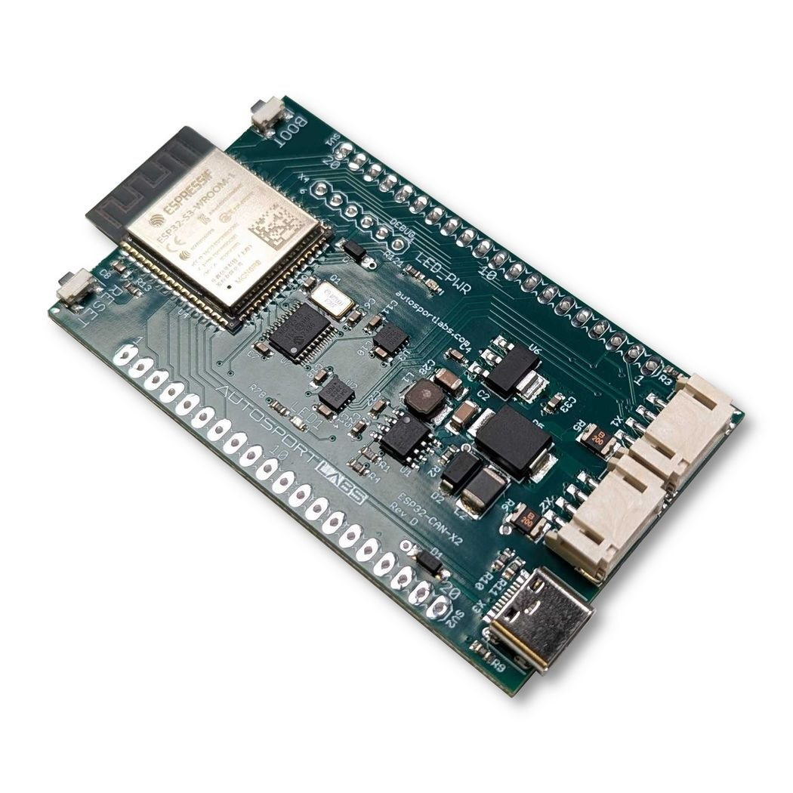

# ESP32-CAN-X2
Code samples for the ESP32-CAN-X2 automotive-grade CAN bus development board

Full documentation: https://wiki.autosportlabs.com/ESP32-CAN-X2

* arduino - code examples for Arduino
* bolt-ons - code examples for Arduino
* circuitpython - code examples for Circuit Python
* esp-idf - code examples for ESP-IDF
* projects - specific project examples

## Hardware
* enclosures - 3D printable enclosures
* bolt-on-template - PCB templates for making your own bolt-on

